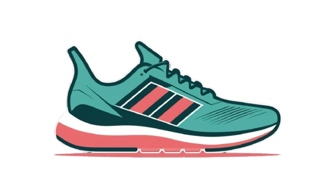

# VansStore E-Commerce Website

Website E-Commerce untuk menjual produk sepatu, dibuat dengan Bootstrap 5.

## Features

- 🛍️ Tampilan Produk yang kece pake carousel
- 📦 Card Produk lengkap dengan gambar dan respon
- 🛒 Keranjang Belanja yang nyimpen data meski browser ditutup
- 🔍 Fitur Search buat cari produk cepat
- 📱 Desain Responsif buat HP dan laptop
- 💳 Sistem Checkout (walapun hanya simulator)

## Pages

1. **Homepage** (`index.html`)
   - Tampilkan produk unggulan
   - Bisa langsung tambah ke keranjang

2. **Products Page** (`product.html`)
   - Produk katalog yang lengkap
   - Fungsi search
   - Produk card yang detail
   - Adanya rating system dalam bentuk bintang

## Dibangun pake

- HTML5
- CSS3
- JavaScript
- Bootstrap 5
- Font Awesome 6

## Installation

Tidak perlu install apapun, cukup buka file 'index.html' di web browser.

## Cara Pake

1. Buka index.html pake browser
2. Jelajahin produknya
3. Klik "Pre Order" buat masukin ke keranjang
4. Klik icon keranjang buat liat isinya
5. Kalo udah yakin, checkout deh!

## Struktur File
vansstore/
├── index.html              #Halaman utama (Homepage)
├── product.html            #Halaman Produk
├── assets/
│ ├── css/                  #Buat ngestyling websitenya
│ │ └── style.css
│ ├── js/                   #Buat jalanin fungsi fungsinya (seacrhbar, keranjang)
│ │ └── script.js
│ └── Images/               #Tempat buat nyimen gambar produk produk
│ ├── logo.png
│ ├── product-img-1.jpeg
│ └── ... (other product images)

## Kostumisasi

To customize:
1. Ganti produk di file HTML
2. Edit tampilan di style.css
3. Ubah fungsi keranjang di script.js

## Screenshots

## License

© Beatrice Ivy Website 2025
